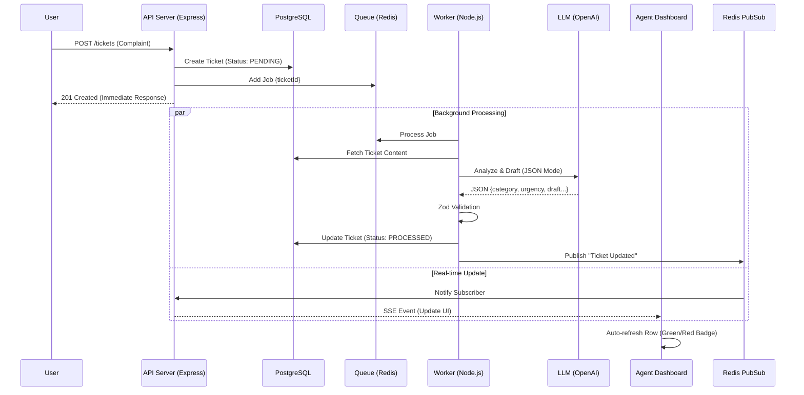

# PRODUCT ANALYSIS & REQUIREMENTS DOCUMENT (PRD)
**Project:** AI Support "Triage & Recovery" Hub (Option A)
**Role:** Senior Full Stack Engineer Assessment
**Date:** Jan 31, 2026

---

## 1. Executive Summary
The **AI Support Triage Hub** solves the "bottleneck" problem in the customer support process. Instead of having CS agents manually read every email, the system automatically receives, categorizes, assesses urgency, and drafts responses using Generative AI.
The key to the system is the **Asynchronous Processing** capability to ensure the fastest end-user experience, while AI handles heavy tasks in the background.

---

## 2. Business Analysis

### 2.1. Pain Points
- **User:** Sends a complaint and has to wait a long time for a response, not knowing if their ticket has been recorded.
- **Agent:** Overloaded by hundreds of spam or simple tickets. Wastes time typing boilerplate responses. Difficult to identify tickets that need urgent handling (VIP/Angry user).
- **System:** Calling AI directly (Synchronous) upon receiving a Request hangs the API for 5-10s, leading to timeouts and a poor experience.

### 2.2. Solution Strategy
- **Decoupling:** Separate "Ingestion" and "Processing" into 2 distinct flows.
- **AI Augmentation:** AI does not replace humans, but acts as a "primary assistant" (Triage Nurse) to prepare ammunition for the Agent to fire.
- **Real-time Feedback:** Update processing status in real-time so Agents feel the system is "alive".

### 2.3. Risk Analysis
| Risk | Level | Mitigation Strategy (Engineering Depth) |
| :--- | :--- | :--- |
| **AI Hallucination** (AI gives wrong answer) | Medium | Agent must always review and click "Approve" before sending. No automatic sending. |
| **Malformed JSON** (AI returns wrong format) | High | Use **Zod** to validate output. If error, Worker will retry or fallback to default value, not crashing the app. |
| **High Load** (Spam ticket) | High | API returns immediately (Non-blocking). Use Queue (Redis) to buffer load. |
| **API Failure** (OpenAI down) | Low | **Exponential Backoff Retry** mechanism in Worker. |

---

## 3. Functional Requirements

### 3.1. Ticket Ingestion API (The "Bottleneck" Test)
- **Actor:** End User / External System.
- **Endpoint:** `POST /api/tickets`
- **Input:** `{ content: string, userEmail: string }`
- **Behavior:**
  1. Validate input (must not be empty).
  2. Create DB record with `PENDING` status.
  3. Push Job to Queue (`ticket-processing`).
  4. **Return immediately** (Response Time < 200ms).
- **Output:** `201 Created` + `{ id: "uuid", status: "queued" }`.

### 3.2. AI Worker Engine (Background Process)
- **Actor:** System (Worker).
- **Trigger:** New Job in Queue.
- **Process:**
  1. Get ticket content.
  2. Call LLM with Technical Prompt (System Prompt) requesting JSON return.
  3. **AI Tasks:**
     - `Category`: Needs classification (Billing, Tech, Feature, Other).
     - `Urgency`: Assess (High, Medium, Low) based on keywords (e.g., "data loss", "urgent").
     - `Sentiment`: Score sentiment (1-10).
     - `Draft`: Draft a polite, empathic response.
  4. Validate JSON output using Zod.
  5. Update DB -> `PROCESSED` status.
  6. Fire `ticket-updates` event to Redis Pub/Sub.

### 3.3. Agent Dashboard (Real-time UI)
- **Actor:** Support Agent.
- **Views:**
  - **List View:** Display ticket list.
    - Sort: Prioritize `High Urgency` at top.
    - Visual: Red badge for High, green for Low.
    - Real-time: Auto-update when Worker finishes processing (via SSE).
  - **Detail View:**
    - View original content.
    - View AI Analysis (Category, Sentiment).
    - Editor: Edit `Draft Response`.
    - Action: Button "Resolve & Send" (Save `finalReply`, change status to `RESOLVED`).

---

## 4. Non-Functional Requirements
*This is the "Engineering Depth" scoring section*

1.  **Performance:** Ingestion API must withstand high load, never waiting for AI.
2.  **Resilience:**
    - If Worker dies, Jobs in Redis must not be lost. When Worker revives, it must continue processing.
    - If Frontend loses connection, it must auto-reconnect.
3.  **Extensibility:**
    - Code must use **Adapter Pattern** for Queue to easily switch from BullMQ to RabbitMQ/Kafka.
4.  **Maintainability:**
    - Absolute Type Safety (Full TypeScript).
    - Strictly managed Environment Variables.

---

## 5. Data Schema & Models

### Table: Tickets
| Field | Type | Description | AI Generated? |
| :--- | :--- | :--- | :--- |
| `id` | UUID | Primary Key | No |
| `content` | String | Complaint content | No |
| `status` | Enum | `PENDING`, `PROCESSED`, `RESOLVED`, `FAILED` | No (Updated by System) |
| `createdAt` | DateTime | Creation time | No |
| `category` | String | Billing, Technical, etc. | **Yes** |
| `urgency` | Enum | `High`, `Medium`, `Low` | **Yes** |
| `sentiment` | Int | 1 (Angry) - 10 (Happy) | **Yes** |
| `draftReply` | Text | AI suggested reply | **Yes** |
| `finalReply` | Text | Agent final reply | No |

---

## 6. Logic Flow (Mermaid Diagram)

